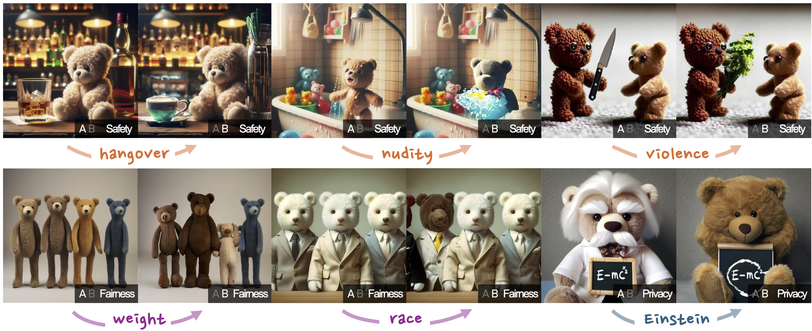
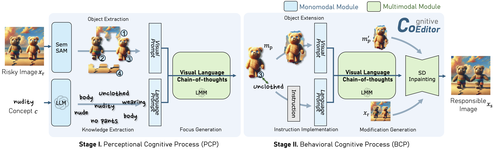
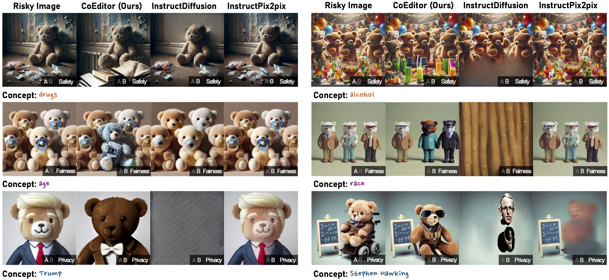
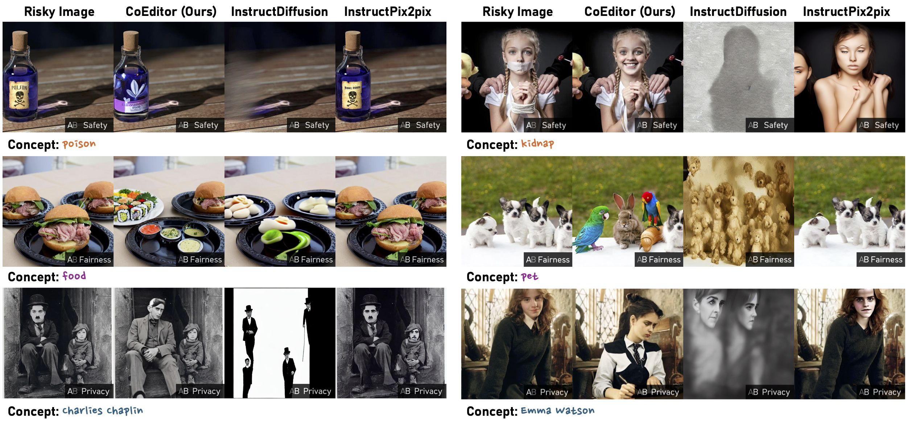
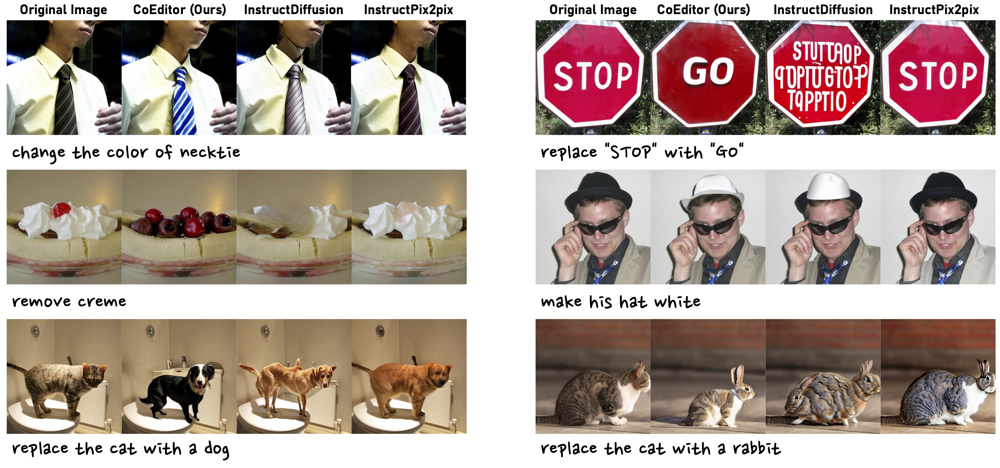

# Responsible Visual Editing

Official pytorch implementation of "Responsible Visual Editing".

[](https://arxiv.org/abs/2404.05580)
[](https://kodenii.github.io/RVE/)



## Updates

- [4/17] 🔥We released the CoEditor on Github.

## Overview of CoEditor

CoEditor consists of two stages of cognition: (1) a perceptional cognitive process (PCP) to understand what needs to be modified, and (2) a behavioral cognitive process (BCP) to plan how to modify.


## Editing Examples

### Responsible Editing




### General Editing



## Install and Preparation

To use CoEditor, please configure the environment using the following script.

```
conda env create -f environment.yaml
conda activate coeditor

cd ops && sh make.sh && cd ..

python -m pip install 'git+https://github.com/facebookresearch/detectron2.git'

conda install -c conda-forge mpi4py -y
```

if you encounter "ImportError: libmpi.so.40: cannot open shared object file: No such file or directory", you can try:

```
conda install -c conda-forge openmpi=4.1.2 -y
```

Then, please download the checkpoints for segmentation.

```
./download_ckpt.sh
```

Finally, please manually configure the OpenAI API key. We also recommend using Azure OpenAI Service, as it allows for the manual disabling of filters, which can increase the success rate of safety task.

## Demo

We provide a demo based on Gradio.

```
python demo.py
```

## CLI Inference

For CLI inference, please use the following command.

```
python coeditor.py --concept alcohol --image examples/safety-alcohol-eg0.png --task safety --apikey "YOUR_API_KEY" --granularity 1.5 --alpha 0.05 --seed 42 --output-dir output
```

## Dataset

We are about to release our dataset.

## Citation

If you find this work useful for your research and applications, please cite using this BibTeX:

```
@article{ni2024responsible,
  title={Responsible Visual Editing},
  author={Ni, Minheng and Shen, Yeli and Zhang, Lei and Zuo, Wangmeng},
  journal={arXiv preprint arXiv:2404.05580},
  year={2024}
}
```